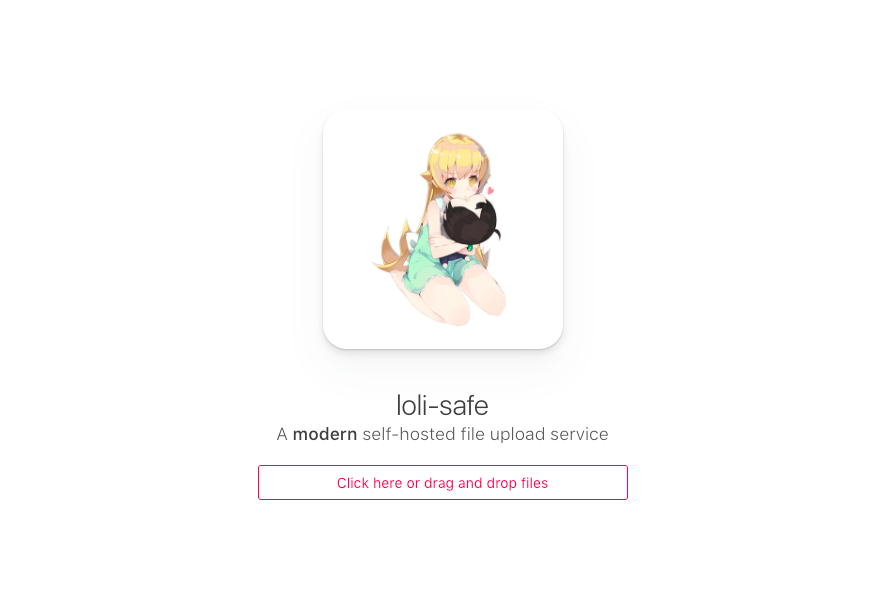

[](https://raw.githubusercontent.com/kanadeko/Kuro/master/LICENSE)
[](https://discord.gg/5g6vgwn)

# lolisafe, a small safe worth protecting.

## What's new in v3.0.0
- Backend rewrite to make it faster, better and easier to extend
- Album downloads (Thanks to [PascalTemel](https://github.com/PascalTemel))
- See releases for changelog

If you're upgrading from a version prior to v3.0.0 make sure to run **ONCE** `node database/migration.js` to create the missing columns on the database.

## Running
1. Ensure you have at least version 7.6.0 of node installed
2. Clone the repo
3. Rename `config.sample.js` to `config.js`
4. Modify port, domain and privacy options if desired
5. run `npm install` to install all dependencies
6. run `pm2 start lolisafe.js` or `node lolisafe.js` to start the service

## Getting started
This service supports running both as public and private. The only difference is that one needs a token to upload and the other one doesn't. If you want it to be public so anyone can upload files either from the website or API, just set the option `private: false` in the `config.js` file. In case you want to run it privately, you should set `private: true`.

Upon running the service for the first time, it's gonna create a user account with the username `root` and password `root`. This is your admin account and you should change the password immediately. This account will let you manage all uploaded files and remove any if necessary.

The option `serveFilesWithNode` in the `config.js` dictates if you want lolisafe to serve the files or nginx/apache once they are uploaded. The main difference between the two is the ease of use and the chance of analytics in the future.
If you set it to `true`, the uploaded files will be located after the host like:
	https://lolisafe.moe/yourFile.jpg

If you set it to `false`, you need to set nginx to directly serve whatever folder it is you are serving your
downloads in. This also gives you the ability to serve them, for example, like this:
	https://files.lolisafe.moe/yourFile.jpg

Both cases require you to type the domain where the files will be served on the `domain` key below.
Which one you use is ultimately up to you. Either way, I've provided a sample config files for nginx that you can use to set it up quickly and painlessly!
- [Normal Version](https://github.com/WeebDev/lolisafe/blob/master/nginx.sample.conf)
- [SSL Version](https://github.com/WeebDev/lolisafe/blob/master/nginx-ssl.sample.conf)

If you set `enableUserAccounts: true`, people will be able to create accounts on the service to keep track of their uploaded files and create albums to upload stuff to, pretty much like imgur does, but only through the API. Every user account has a token that the user can use to upload stuff through the API. You can find this token on the section called `Change your token` on the administration dashboard, and if it gets leaked or compromised you can renew it by clicking the button titled `Request new token`.

## Cloudflare Support
If you are running lolisafe behind Cloudflare there is support to make the NGINX logs have the users IP instead of Cloudflares IP. You will need to compile NGINX from source with `--with-http_realip_module` as well as uncomment the following line in the NGINX config: `include /path/to/lolisafe/real-ip-from-cf;`

## Using lolisafe
Once the service starts you can start hitting the upload endpoint at `/api/upload` with any file. If you're using the frontend to do so then you are pretty much set, but if using the API to upload make sure the form name is set to `files[]` and the form type to `multipart/form-data`. If the service is running in private mode, dont forget to send a header of type `token: YOUR-CLIENT-TOKEN` to validate the request.

A sample of the returning json from the endpoint can be seen below:
```json
{
	"name": "EW7C.png",
	"size": "71400",
	"url": "https://i.kanacchi.moe/EW7C.png"
}
```

To make it easier and better than any other service, you can download [our Chrome extension](https://chrome.google.com/webstore/detail/lolisafe-uploader/enkkmplljfjppcdaancckgilmgoiofnj) that will let you configure your hostname and tokens, so that you can simply `right click` ->  `loli-safe` -> `send to safe` to any image/audio/video file on the web.

Because of how nodejs apps work, if you want it attached to a domain name you will need to make a reverse proxy for it. Here is a tutorial [on how to do this with nginx](https://www.digitalocean.com/community/tutorials/how-to-set-up-a-node-js-application-for-production-on-ubuntu-16-04). Keep in mind that this is only a requirement if you want to access your lolisafe service by using a domain name, otherwise you can use the service just fine by accessing it from your server's IP.

## Sites using lolisafe
- [lolisafe.moe](https://lolisafe.moe): A small safe worth protecting.
- [safe.moe](https://safe.moe): The world's most ~~un~~safe pomf clone
- [safe.fiery.me](https://safe.fiery.me): Just another clone.
- [kayo.moe](https://kayo.moe): File hosting for all~
- [dmca.gripe](https://dmca.gripe): a dmca-resistant, permanent file hosting service.
- [succmy.wang](https://succmy.wang): A private clone with a funny name
- [i-want-to.2dgirls.date](https://i-want-to.2dgirls.date): A clone that screams what you want
- [namir.in](https://namir.in): A private clone dedicated to best girl.
- [safe.waliant.pw](https://safe.waliant.pw): A generic private clone for personal use.
- [a.hyper.lol](https://a.hyper.lol): My personal clone with some ~~terrible~~ great changes.
- [i.pyr0.pw](https://i.pyro0.pw): Private Lolisafe Setup With NGINX Cloudflare.
- [isis.dating](https://isis.dating): Randomg Setup By A Random User With Random Intentions.
- Feel free to add yours here.

## Author

**lolisafe** © [Pitu](https://github.com/Pitu), Released under the [MIT](https://github.com/WeebDev/lolisafe/blob/master/LICENSE) License.<br>
Authored and maintained by Pitu.

> [lolisafe.moe](https://lolisafe.moe) · GitHub [@Pitu](https://github.com/Pitu)
